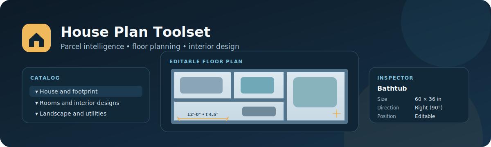

# House Plan Toolset



House Plan Toolset is a Python and FastAPI application for reviewing a residential parcel, editing its house and floor plans, designing room interiors, and persisting the result as an ontology-aligned Neo4j graph.

## Key Capabilities

- Browse Neo4j parcels or analyze local parcel GeoJSON in a three-panel catalog, viewport, and inspector interface.
- Edit the house footprint and organize rooms across the basement, first floor, and second floor.
- Add, remove, move, and resize rooms; edit room name, type, width, and depth; and rotate constrained stair cores.
- Add, remove, and position walls, doors, and windows. Wall thickness is rendered to scale, openings inherit their host-wall thickness, and engineering-style wall dimensions show length and thickness.
- Design bathrooms, bedrooms, and general rooms with editable components such as vanities, showers, bathtubs, toilets, beds, storage, chairs, sofas, and tables.
- Move, resize, remove, and rotate every interior component using Up, Right, Down, and Left directions. Components remain constrained inside the room.
- Zoom parcel, floor-plan, and interior-design viewports from 50% to 1000%.
- Save the house footprint, rooms, wall/opening layouts, interior component layouts, and landscape features back to Neo4j.
- Load Suffolk County house footprints and contour-based parcel elevation data.
- Generate Markdown site-assessment reports and SVG concept diagrams.

## Quick Start

Requirements:

- Python 3.12 or newer
- [`uv`](https://docs.astral.sh/uv/)
- Neo4j when using graph-backed loading and saving
- A sibling `../neo4j-onto2ai-toolset` checkout, as configured in `pyproject.toml`

Install dependencies and start the application:

```bash
uv sync
uv run house-landscape serve --host 127.0.0.1 --port 8181
```

Open `http://127.0.0.1:8181`. The web application defaults to database `hp62n`.

## Neo4j Configuration

Set the standard Onto2AI connection variables before using Neo4j workflows:

```bash
export NEO4J_MODEL_DB_URL="bolt://localhost:7687"
export NEO4J_MODEL_DB_USERNAME="neo4j"
export NEO4J_MODEL_DB_PASSWORD="your_password"
```

Load the bundled parcel, attach a house footprint, optionally refresh elevation, and start the UI:

```bash
uv run house-landscape load-neo4j \
  --parcel /path/to/parcel.geojson \
  --database hp62n

uv run house-landscape load-house-footprint \
  --parcel-id 0200154000400039003 \
  --house /path/to/house-footprint.geojson \
  --database hp62n

uv run house-landscape load-elevation \
  --parcel-id 0200154000400039003 \
  --database hp62n

uv run house-landscape serve --host 127.0.0.1 --port 8181
```

To obtain the house footprint directly from Suffolk GIS, use:

```bash
uv run house-landscape load-house-footprint-gis \
  --parcel-id 0200154000400039003 \
  --database hp62n
```

See [README4LOADER.md](README4LOADER.md) for the complete loader and persistence workflow.

## Floor and Interior Editing

Floor-plan rooms expose editable identity, geometry, and structure:

- room name and room type
- physical width and depth
- floor position and footprint
- stair direction and constrained stair width
- wall edge, span, and thickness
- door and window edge and span

The interior-design viewport supports bathroom, bedroom, and general-room component libraries. Each component stores its type, label, position, size, and `direction_degrees`. A 90-degree direction change swaps the occupied width and depth, then clamps the component to the room boundary.

Generated residential walls default to a 4.5-inch finished partition. The wall editor accepts 1–24 inches, and the viewport maintains the physical wall-to-room ratio at every zoom level.

The Save action is available for parcels loaded from Neo4j. Browser-only GeoJSON analysis remains read-only.

## CLI Commands

```text
house-landscape analyze                  Generate a Markdown site assessment
house-landscape illustrate               Generate an SVG concept-zoning diagram
house-landscape serve                    Start the FastAPI web application
house-landscape load-neo4j               Load parcel GeoJSON into Neo4j
house-landscape load-house-footprint     Attach local house-footprint GeoJSON
house-landscape load-house-footprint-gis Attach the Suffolk GIS house footprint
house-landscape load-elevation           Refresh Suffolk contour elevation data
```

Use `uv run house-landscape <command> --help` for command-specific options.

## API Routes

| Method | Route | Purpose |
| --- | --- | --- |
| `GET` | `/health` | Application health check |
| `GET` | `/api/sample` | Sample assessment payload |
| `GET` | `/api/neo4j/parcels` | List parcels in a Neo4j database |
| `GET` | `/api/neo4j/parcels/{parcel_id}` | Load a parcel assessment and saved design |
| `POST` | `/api/neo4j/parcels/{parcel_id}/features` | Save landscape, house, room, structure, and interior edits |
| `DELETE` | `/api/neo4j/parcels/{parcel_id}/features/{feature_id}` | Remove a landscape feature |
| `POST` | `/api/neo4j/parcels/{parcel_id}/house-footprint` | Upload a local house footprint |
| `POST` | `/api/neo4j/parcels/{parcel_id}/house-footprint/gis` | Load a Suffolk GIS house footprint |
| `POST` | `/api/neo4j/parcels/{parcel_id}/elevation` | Refresh Suffolk contour elevation |
| `POST` | `/api/analyze` | Analyze uploaded parcel GeoJSON without saving |

## Project Layout

```text
data/input/                         Optional local parcel and footprint inputs
data/output/                        Generated reports and diagrams
resource/images/                    Repository documentation artwork
resource/ontology/                  RDF ontologies and Cypher companions
src/house_landscape_planner/        Analysis, models, loaders, CLI, and web app
tests/                              Loader, geometry, API, and UI regressions
```

## Ontologies

RDF is the source of truth. Cypher companions mirror the same URI base, class/property fragments, and semantics.

- Landscape: [Landscape.rdf](resource/ontology/www_onto2ai-toolset_com/ontology/landscape/Landscape.rdf) and [Landscape.cypher](resource/ontology/www_onto2ai-toolset_com/ontology/landscape/Landscape.cypher)
- House: [House.rdf](resource/ontology/www_onto2ai-toolset_com/ontology/house/House.rdf) and [House.cypher](resource/ontology/www_onto2ai-toolset_com/ontology/house/House.cypher)
- Interior design: [InteriorDesign.rdf](resource/ontology/www_onto2ai-toolset_com/ontology/interior-design/InteriorDesign.rdf) and [InteriorDesign.cypher](resource/ontology/www_onto2ai-toolset_com/ontology/interior-design/InteriorDesign.cypher)

Persisted `Room` properties include `wallLayoutJson`, `doorLayoutJson`, `windowLayoutJson`, and `interiorDesignLayoutJson` so the browser editor can restore saved room geometry and components.

## Development and Validation

```bash
uv sync
uv run pytest -q
xmllint --noout resource/ontology/www_onto2ai-toolset_com/ontology/house/House.rdf
xmllint --noout resource/ontology/www_onto2ai-toolset_com/ontology/interior-design/InteriorDesign.rdf
```

Static web assets use explicit cache-version query strings, and the FastAPI application revalidates `/` and `/static/` responses so browser testing picks up current UI code.

## Current Scope

The project is a residential property-planning and interior-layout foundation. It is not yet a construction-document, permitting, estimating, or maintenance-management platform.
